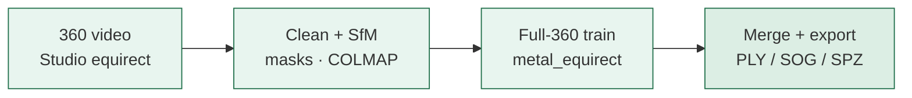

# InstaSplat

**A full Mac pipeline: Insta360 360° video → navigable 3D Gaussian splat.**

InstaSplat is not a single tool wrapper. It is a **local Apple Silicon pipeline**
that takes a stitched equirectangular walk and produces a splat you can explore
(`.ply` / `.sog` / `.spz`) — including the hard parts most stacks leave out:
people masks, Mac-reliable SfM, **full-360 training**, and long-walk tile merge.

<p align="center">
  
</p>

<p align="center"><em>Capture a place in 360° → reconstruct a world you can walk again.</em></p>

**Start here:** [docs/MAC_360_PIPELINE.md](docs/MAC_360_PIPELINE.md) — why this
pipeline is needed and how InstaSplat builds it.

---

## Why a full Mac 360 → splat pipeline?

360 cameras excel at **recording** a place. Turning that into a **flyable 3D
scene** usually means chaining stitch → frames → SfM → train → export by hand —
and most of those pieces were built for pinhole cameras, NVIDIA GPUs, or short clips.

On a Mac the gaps are sharper:

| Need | What breaks without a full pipeline |
|------|-------------------------------------|
| True 360 input | Flat reframes and dual-fisheye without Studio stitch fail reconstruction |
| Mac-local run | MediaSDK stitch and CUDA trainers are not the laptop default |
| Full sphere quality | Perspective-only trainers discard most of each panorama |
| Long / 8K walks | One giant COLMAP+train job does not finish; tiles must align and merge |
| Clean geometry | Unmasked people become permanent ghosts in the splat |

InstaSplat’s purpose is to **create that end-to-end path** on Apple Silicon —
Studio equirect in, viewer-ready splat out — with optional cloud only where Mac
fundamentally cannot (official MediaSDK, CUDA research trainers).

---

## What InstaSplat creates

One coordinated job that:

1. **Ingests** Studio equirect MP4 + gyro/GPS  
2. **Plans tiles** for long walks (overlap, denser fps on turns)  
3. **Masks people** (YOLO on Apple MPS)  
4. **Reconstructs** with COLMAP on cubemap faces (Mac-reliable)  
5. **Scales / refines** poses when sensors allow  
6. **Trains** with **metal_equirect** — full panoramas, not pinhole crops  
7. **Aligns & merges** tiles into one scene  
8. **Exports** `.ply` / `.sog` / `.spz` (+ quality / cloud handoff)

<p align="center">
  
</p>



Deep dive: [docs/MAC_360_PIPELINE.md](docs/MAC_360_PIPELINE.md).

---

## Long walks (tiled product path)

Real captures are often multi-minute 8K. The pipeline **tiles** the timeline,
reconstructs each tile on Metal, aligns with **GPS + gyro**, then merges:

<p align="center">
  
</p>

```bash
instasplat mac-360 -i ./capture_equirect_8k.mp4 -o ./runs -n beach_walk
```

That command **is** the full Mac pipeline for large captures.

---

## Quick start

### 1. Capture for the pipeline

1. Record with an Insta360 (slow walk, overlap, fewer crowds)  
2. Export **equirectangular** MP4 from **Insta360 Studio**  
3. Keep the sibling `.insv` (or `gyro.csv` / `gps.csv`) beside it  

MediaSDK does not run on macOS — Studio stitch is the supported local input.
See [docs/CAPTURE_GUIDELINES.md](docs/CAPTURE_GUIDELINES.md).

### 2. Install the pipeline tools

```bash
git clone https://github.com/Browens5/InstaSplat.git
cd InstaSplat
./scripts/setup_macos.sh
source .venv/bin/activate
instasplat doctor            # mac_long_360 should be yes
```

Repair later: `instasplat setup` · [docs/SETUP_MACOS.md](docs/SETUP_MACOS.md).

### 3. Run the full pipeline

```bash
instasplat mac-360 -i ./capture_equirect_8k.mp4 -o ./runs -n beach_walk

# Same pipeline with live 3D + artifacts
instasplat gui
```

Outputs: `runs/beach_walk/06_export/` (`scene.ply` / `.sog` / `.spz`).

Day-to-day commands & knobs: [docs/METAL_SPLAT_WORKFLOW.md](docs/METAL_SPLAT_WORKFLOW.md).

---

## Resume and run sections

The job folder is resume-safe. Re-run only what failed:

```bash
instasplat stages
instasplat run --job ./runs/beach_walk --only process_chunks
instasplat run --job ./runs/beach_walk --from align_chunks --to package
instasplat train-equirect -j ./runs/beach_walk --steps 8000
```

GUI: **Open previous run…** → select stages → **Continue run**.

---

## Pipeline map

| Stage | Role in the full path |
|-------|------------------------|
| `ingest` | Lock video + telemetry |
| `plan_chunks` / `process_chunks` / `align_chunks` / `merge_chunks` | Long-walk tiling |
| `extract` / `mask` | Frames + people removal (MPS) |
| `sfm` / `scale` / `refine` | Cameras, metric scale, pose polish |
| `train` | **metal_equirect** full-360 Gaussians (MPS/Metal) |
| `export` / `package` | Viewer formats + quality / cloud package |

---

## Desktop app

- Metal-first defaults for the long-360 pipeline  
- Pause / Resume / Stop at stage checkpoints  
- Live COLMAP / splat viewer + artifact browser  
- Multi-select stages; continue previous jobs  

---

## Documentation

| Guide | Read when |
|-------|-----------|
| **[docs/MAC_360_PIPELINE.md](docs/MAC_360_PIPELINE.md)** | **Why the pipeline is needed and how it is built** |
| [docs/METAL_SPLAT_WORKFLOW.md](docs/METAL_SPLAT_WORKFLOW.md) | Install → run → knobs → troubleshooting |
| [docs/SETUP_MACOS.md](docs/SETUP_MACOS.md) | One-shot / manual install |
| [docs/MAC_LONG_360.md](docs/MAC_LONG_360.md) | Tiled long / 8K defaults |
| [docs/METAL_EQUIRECT_TRAINER.md](docs/METAL_EQUIRECT_TRAINER.md) | Full-360 trainer architecture |
| [docs/CAPTURE_GUIDELINES.md](docs/CAPTURE_GUIDELINES.md) | How to film for this pipeline |
| [docs/LARGE_8K.md](docs/LARGE_8K.md) | Chunk / fps / merge tuning |
| [docs/FEASIBILITY.md](docs/FEASIBILITY.md) | Mac vs cloud tradeoffs |
| [docs/CLOUD.md](docs/CLOUD.md) | Optional CUDA / hybrid workers |

Index: [docs/README.md](docs/README.md).

---

## Tips

- Walk **slowly**; pause slightly at turns  
- Prefer **overlap** over a single sprint  
- Export **equirectangular** from Studio, not a flat reframe  
- Keep free disk — 8K tiles are large  

---

## FAQ

**Do I need an NVIDIA GPU?**  
No for the Mac path. Training uses PyTorch MPS / Apple Metal. CUDA is optional via cloud handoff.

**Can I skip Studio and use raw `.insv` only?**  
Not for production quality on Mac. Studio equirect export is the supported stitch.

**Is the scene true-to-scale?**  
Only with GPS scale or a known measured distance. Otherwise it looks right but units are arbitrary.

**Can I pause overnight?**  
Yes in the GUI — Pause stops at stage checkpoints; Resume continues.

---

## License

MIT for InstaSplat code. Upstream tools keep their own licenses (COLMAP, PyTorch,
YOLO/Ultralytics, splat-transform, Insta360 SDK where used).

---

<p align="center">
  <strong>InstaSplat</strong> — the full Mac path from 360 video to a world you can walk again.
</p>
