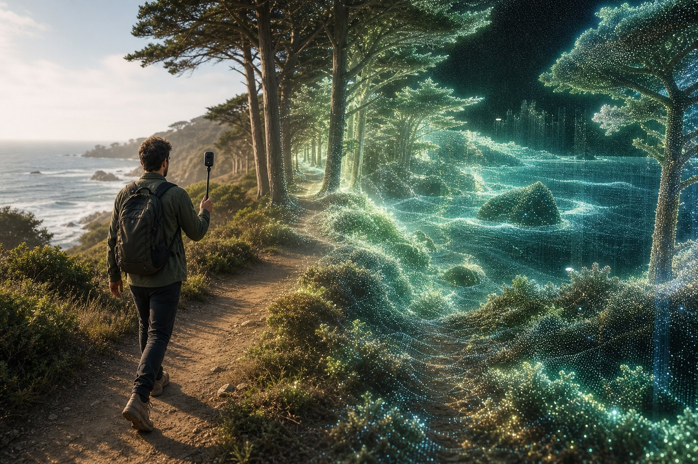
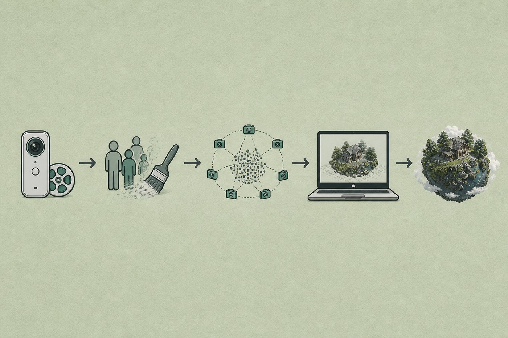
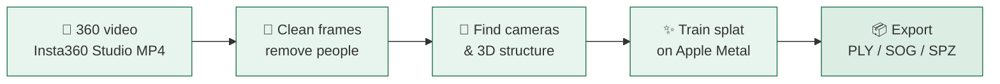
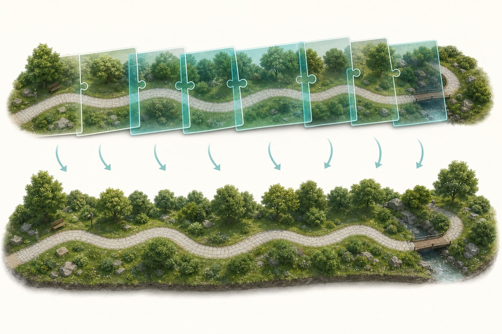
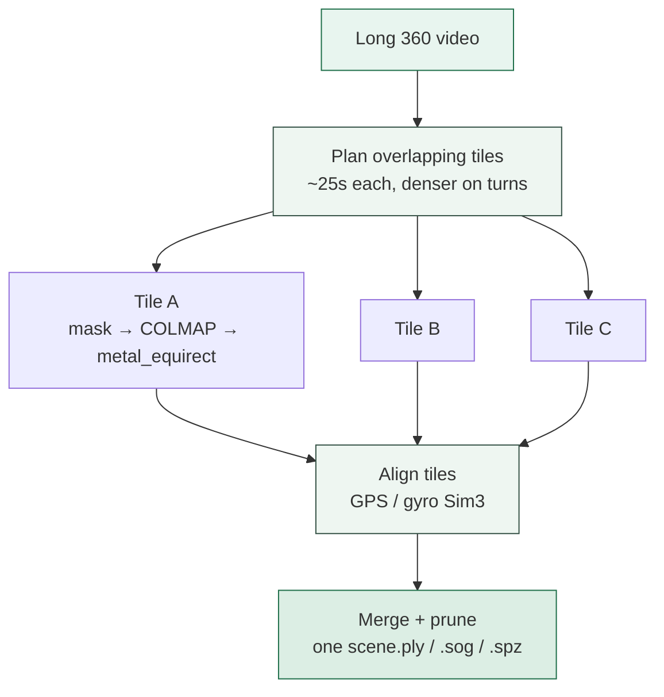
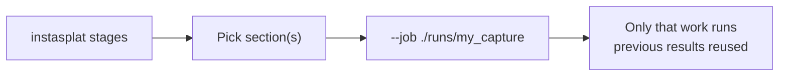

# InstaSplat

**Turn a long Insta360 walk into a navigable 3D world — on your Mac.**

InstaSplat is a local macOS app/pipeline that takes 360° video and builds a
[3D Gaussian splat](https://repo-sam.inria.fr/fungraph/3d-gaussian-splatting/):
a lightweight, photoreal scene you can fly through in a viewer, share as a file,
or send to other tools.

<p align="center">
  
</p>

<p align="center"><em>Film a place in 360° → reconstruct it as an immersive digital twin.</em></p>

---

## Why this exists

360 cameras are great at *capturing* a place. They are not great at giving you
something you can **explore later like a game level** — walk around, look up,
relive a trail, or archive a site in 3D.

InstaSplat bridges that gap for Apple Silicon Macs:

| You have | You want | InstaSplat does |
|----------|----------|-----------------|
| An Insta360 capture (Studio equirect MP4) | A 3D scene file (`.ply` / `.sog` / `.spz`) | Automates the hard reconstruction steps |
| A long walk / large outdoor space | One merged splat, not a dozen broken clips | Tiles the video, aligns with GPS/gyro, merges |
| People walking through your footage | Cleaner geometry | YOLO people masks (Metal GPU) |
| A laptop, not a cloud GPU farm | Local control + privacy | Native metal_equirect training (MPS/Metal) |

It is **open source (MIT)** and designed **local-first**. Optional cloud steps
exist for things Macs cannot do well (official Insta360 MediaSDK stitch, CUDA
research trainers).

---

## What you get

After a successful run you typically have:

- **`scene.ply`** — standard Gaussian splat (widely supported)
- **`scene.sog` / `scene.spz`** — compressed formats for sharing / web viewers
- Optional **quality report**, **LOD previews**, and packaging for other tools

Open the splat in PlayCanvas, SuperSplat, MetalSplatter, and similar apps.

---

## How it works (big picture)

<p align="center">
  
</p>



### In plain language

1. **Ingest** — find your stitched 360 video and read motion sensors (gyro / GPS)
2. **Sample frames** — pull stills at a smart rate (more frames when you turn)
3. **Mask people** — paint out pedestrians so they do not become “ghost geometry”
4. **Reconstruct** — estimate where the camera was for each frame (COLMAP)
5. **Scale** — optionally make the scene true-to-meters using GPS or a measured distance
6. **Train** — fit millions of tiny 3D “paint blobs” (Gaussians) so the scene looks real
7. **Export** — write files you can open in splat viewers

---

## Long walks & 8K video (tiled mode)

A ten-minute 8K@30 capture is huge. InstaSplat does **not** try to force every
frame into one giant job. Instead it:

1. Splits the timeline into overlapping **tiles**
2. Reconstructs each tile on your Mac (Metal)
3. Aligns tiles with **GPS + gyro**
4. Merges them into one large splat

<p align="center">
  
</p>



This is the **recommended Mac path** for large captures:

```bash
instasplat mac-360 -i ./capture_equirect_8k.mp4 -o ./runs -n beach_walk
```

---

## Quick start (macOS)

### 1. Capture & stitch

1. Record with an Insta360 (prefer steady walking, good overlap, few crowds)
2. In **Insta360 Studio**, export a stitched **equirectangular MP4**
3. Keep the original `.insv` next to that MP4 (gyro/GPS), or add `gyro.csv` / `gps.csv`

> Official Insta360 MediaSDK does **not** run on macOS. Studio export is the
> supported local stitch path.

### 2. Install

```bash
git clone https://github.com/Browens5/InstaSplat.git
cd InstaSplat

python3 -m venv .venv
source .venv/bin/activate
pip install -e ".[gui,dev]"

./scripts/setup_macos.sh     # ffmpeg, COLMAP, splat-transform
pip install -e ".[gui,dev]" # includes PyTorch for metal_equirect
instasplat doctor            # confirms mac_long_360 readiness
```

### 3. Run

```bash
# Best for long / 8K walks
instasplat mac-360 -i ./capture_equirect_8k.mp4 -o ./runs -n beach_walk

# Or use the desktop UI
instasplat gui
```

Outputs appear under `runs/beach_walk/06_export/`.

---

## Run one section at a time

Useful when something fails midway (for example, masks finished but training did not):

```bash
instasplat stages                      # list every section
instasplat stage mask -j ./runs/beach_walk
instasplat run --job ./runs/beach_walk --only process_chunks
instasplat run --job ./runs/beach_walk --from align_chunks --to package
```

In the GUI, multi-select **Stages** before pressing Run.



---

## Pipeline map (technical)

| Stage | Everyday meaning | Tools |
|-------|------------------|-------|
| `ingest` | Find video + sensors | ffmpeg / INSV trailer / sidecars |
| `extract` | Pull still frames | ffmpeg |
| `mask` | Hide people | YOLO on Apple **MPS** |
| `sfm` | Solve camera path + sparse 3D | COLMAP |
| `scale` | Make units meters | GPS / measured distance |
| `refine` | Polish poses | COLMAP BA + gyro/GPS blend |
| `train` | Build the splat | **metal_equirect** (native 360, MPS/Metal) |
| `export` | Convert formats | splat-transform |
| `package` | Side packages + quality report | Nerfstudio / LOD / `cloud_job.json` |
| `plan_chunks` … `merge_chunks` | Long-video tiling | gyro + GPS + Metal |

Full long-360 guide: **[docs/MAC_LONG_360.md](docs/MAC_LONG_360.md)**

---

## Desktop app features

- Metal-first defaults for long 360 jobs
- **Pause / Resume / Stop** (pauses training with SIGSTOP)
- Live **task ETA** and overall progress
- Multi-select stages

---

## Project layout

```text
InstaSplat/
├── README.md                 ← you are here
├── assets/                   ← diagrams for this README
├── docs/                     ← detailed guides (see docs/README.md)
├── examples/                 ← sample YAML configs
├── scripts/                  ← setup_macos, mac-360 helper
├── instasplat/               ← Python package (CLI + GUI + stages)
└── tests/                    ← unit tests
```

---

## Documentation index

| Guide | When to read it |
|-------|-----------------|
| [docs/SETUP_MACOS.md](docs/SETUP_MACOS.md) | First-time install |
| [docs/MAC_LONG_360.md](docs/MAC_LONG_360.md) | Long / 8K tiled jobs |
| [docs/CAPTURE_GUIDELINES.md](docs/CAPTURE_GUIDELINES.md) | How to film for better results |
| [docs/LARGE_8K.md](docs/LARGE_8K.md) | Tuning chunk size, fps, merge |
| [docs/FEASIBILITY.md](docs/FEASIBILITY.md) | Mac vs cloud tradeoffs |
| [docs/CLOUD.md](docs/CLOUD.md) | Hybrid / CUDA workers |
| [docs/RESEARCH_STRATEGIES.md](docs/RESEARCH_STRATEGIES.md) | Research inspiration |

---

## Tips for good results

- Walk **slowly and smoothly**; pause slightly at turns
- Prefer **overlap** — do not sprint down a path once
- Avoid dense crowds when possible (masks help, but empty scenes reconstruct better)
- Export **equirectangular** from Studio, not a flat reframed clip
- Keep free disk space — 8K tiles are storage-hungry

---

## FAQ

**Do I need a NVIDIA GPU?**  
No for the Mac path. metal_equirect uses PyTorch MPS / Apple Metal. Optional cloud CUDA (3DGUT) remains for scale.

**Can I feed a raw `.insv` with no Studio export?**  
Not for production quality on Mac. Use Studio to stitch, or a Linux MediaSDK worker.

**Is the scene true-to-scale?**  
Only if you enable GPS scale (or a known measured distance). Otherwise it still looks right, but units are arbitrary.

**What if YOLO crashes on Metal?**  
InstaSplat retries that frame on CPU and can switch the rest of the job to CPU automatically.

**Can I pause overnight training?**  
Yes in the GUI — Pause freezes the pipeline and training process; Resume continues.

---

## License

MIT for InstaSplat code.

Upstream tools keep their own licenses (COLMAP BSD, PyTorch/BSD-style, YOLO/Ultralytics terms, splat-transform MIT, Insta360 SDK proprietary).

---

<p align="center">
  <strong>InstaSplat</strong> — from a walk in the world to a world you can walk again.
</p>
