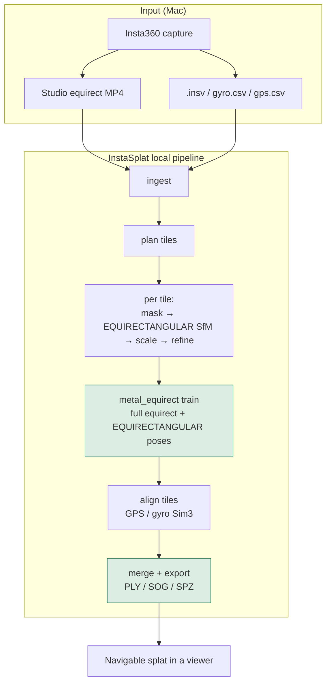

# The Mac 360° video → splat pipeline

InstaSplat exists to build a **complete, local pipeline** on Apple Silicon:
from a stitched Insta360 equirectangular video to a navigable 3D Gaussian splat.

This document explains **why that pipeline is needed**, **what “full” means**,
and **how InstaSplat creates it**. For day-to-day commands, see
[METAL_SPLAT_WORKFLOW.md](METAL_SPLAT_WORKFLOW.md). For install only, see
[SETUP_MACOS.md](SETUP_MACOS.md).

---

## 1. The need

### What people actually capture

Insta360 (and similar) cameras record **full spheres** — every direction at once —
often as long outdoor walks at 5.7K or 8K. That footage is ideal for digital twins,
site archives, trails, and places you want to **revisit in 3D**.

What people want next is not another flat reframe. They want a **splat**: a compact
3D scene they can fly through in SuperSplat, MetalSplatter, PlayCanvas, and similar
viewers (`.ply` / `.sog` / `.spz`).

### Why a dedicated Mac pipeline is required

Off-the-shelf pieces do not form a full path by themselves:

| Gap | Reality on a Mac |
|-----|------------------|
| **Stitch** | Official Insta360 MediaSDK is **not** on macOS. Local stitch = Insta360 Studio equirect export. |
| **360 ≠ pinhole** | Most SfM / splat trainers assume perspective cameras. Full equirect needs COLMAP **EQUIRECTANGULAR** **and** a trainer that supervises panoramas. |
| **Long walks** | A multi-minute 8K clip will not fit one COLMAP + train job. You need tiling, sensor-aware align, and merge. |
| **Dynamics** | Pedestrians become “ghost geometry” unless masked before reconstruction. |
| **Scale & continuity** | Without GPS/gyro (or a known distance), tiles drift and units are arbitrary. |
| **Local-first** | Many research trainers are CUDA-only. A Mac product needs an MPS/Metal training path. |

InstaSplat’s job is to **close those gaps in one coordinated pipeline** — not to be
yet another isolated trainer or COLMAP wrapper.

### What “full pipeline” means here

A full 360 → splat Mac pipeline must do **all** of the following, end to end:

1. Accept Studio equirect video + motion telemetry (`.insv` / gyro / GPS)
2. Sample frames intelligently (more where you turn)
3. Mask people on Apple GPU
4. Reconstruct cameras (COLMAP) in a Mac-reliable way
5. Optionally set metric scale
6. Train a Gaussian splat on **full 360** views (not cropped pinhole only)
7. Export viewer-ready formats
8. For long captures: **tile → align → merge** into one scene

Skip any of those and you no longer have a product path — you have a science demo.

---

## 2. Creating the pipeline (architecture)

InstaSplat implements that path as ordered **stages** driven by one config and one
job folder. The recommended product command is `instasplat mac-360`.



### Design choices that make the Mac path work

| Problem | Pipeline choice |
|---------|-----------------|
| COLMAP + full sphere | Native **EQUIRECTANGULAR** camera model (COLMAP ≥ 4.1) on staged panoramas |
| Faster SfM (optional) | `sfm.mapper: global` uses COLMAP’s GLOMAP `global_mapper` (incremental remains default) |
| Trainers ignore most of the sphere | **metal_equirect** trains on the same full panoramas (poses already 360) |
| Long / 8K video | **Overlapping time tiles**, denser fps on turns, serialized MPS train |
| Tile seams / drift | **GPS + gyro Sim3** align with quality gates |
| People in frame | **YOLO-seg on MPS** → masks into SfM / train |
| No CUDA on the laptop | PyTorch **MPS / Metal**; optional `cloud_job.json` for CUDA later |

Trainer internals: [METAL_EQUIRECT_TRAINER.md](METAL_EQUIRECT_TRAINER.md).  
Tiling defaults: [MAC_LONG_360.md](MAC_LONG_360.md).

---

## 3. Stages (how the pipeline is built)

### Tiled product path (`mac-360`)

| Stage | Role in the full pipeline |
|-------|---------------------------|
| `ingest` | Lock input video; extract / attach gyro & GPS |
| `plan_chunks` | Split the walk into overlapping tiles (path- and turn-aware) |
| `preflight` | Fail fast if stitch, tools, disk, or torch are missing |
| `process_chunks` | For each tile: mask → EQUIRECTANGULAR COLMAP → scale → refine → **train** → tile export |
| `align_chunks` | Register tiles into one coordinate frame |
| `merge_chunks` | Merge Gaussians; prune; write combined products |
| `package` | `quality.json`, LOD previews, optional cloud handoff |

Inside each tile, training is the Mac-native **metal_equirect** backend only
(equirect frames + COLMAP poses, PyTorch MPS).

### Short-clip path (`instasplat run`)

Same reconstruction idea without chunk plan/merge:

`ingest → extract → mask → sfm → scale → refine → train → export → package`

Use this for experiments and short takes; use **tiled** for real walks.

---

## 4. Job layout (what the pipeline creates on disk)

```text
runs/<name>/
  00_ingest/                 equirect + telemetry
  10_chunks/
    manifest.json
    chunk_000/
      01_frames/equirect/    panoramas
      02_masks/equirect/
      03_sfm/                images_equirect + EQUIRECTANGULAR sparse model
      05_train/exports/      scene.ply, previews, heartbeat
  11_merged/                 aligned / merged splat
  06_export/                 final PLY / SOG / SPZ
  quality.json
  cloud_job.json             optional CUDA upgrade package
```

That folder **is** the pipeline artifact: resume-safe, inspectable in the GUI
live viewer, and re-runnable stage by stage.

---

## 5. Create and run a pipeline job

### Prerequisites

- Apple Silicon Mac (recommended), macOS 13+
- Insta360 Studio equirectangular MP4 (+ sibling `.insv` or gyro/GPS CSV)
- One-shot install:

```bash
./scripts/setup_macos.sh
source .venv/bin/activate
instasplat doctor    # mac_long_360 should be yes
```

Details: [SETUP_MACOS.md](SETUP_MACOS.md). Capture tips: [CAPTURE_GUIDELINES.md](CAPTURE_GUIDELINES.md).

### One command (recommended)

```bash
instasplat mac-360 -i ./capture_equirect.mp4 -o ./runs -n walk_360
```

Or open the same pipeline in the desktop UI: `instasplat gui`.

### Resume / section work

```bash
instasplat run --job ./runs/walk_360 --only process_chunks
instasplat run --job ./runs/walk_360 --from align_chunks --to package
instasplat train-equirect -j ./runs/walk_360 --steps 8000
```

---

## 6. What success looks like

You have a full Mac pipeline when:

- Input is a **true equirect** Studio export (not a flat reframe)
- `instasplat doctor` reports **mac_long_360 = yes**
- A tiled job produces **`06_export/scene.ply`** (and usually `.sog` / `.spz`)
- Long walks produce **merged** geometry, not a pile of disconnected tile PLYs
- Training used **full 360** supervision via metal_equirect (not a pinhole-only crop)

Open the result in any Gaussian viewer that reads PLY/SOG/SPZ.

---

## 7. Boundaries (honest scope)

| In scope on Mac | Out of scope / elsewhere |
|-----------------|--------------------------|
| Studio → frames → masks → SfM → metal_equirect → export | Official MediaSDK stitch (Win/Linux) |
| Long-walk tiling + GPS/gyro merge | CUDA-only research trainers (3DGUT, etc.) as the default |
| Local privacy and laptop iteration | Guaranteed metric scale without GPS or a measured distance |

Optional hybrid scale-up: [CLOUD.md](CLOUD.md). Feasibility notes: [FEASIBILITY.md](FEASIBILITY.md).

---

## See also

| Doc | Role |
|-----|------|
| [METAL_SPLAT_WORKFLOW.md](METAL_SPLAT_WORKFLOW.md) | Install, run, knobs, troubleshooting |
| [MAC_LONG_360.md](MAC_LONG_360.md) | Tiled defaults and safety rails |
| [METAL_EQUIRECT_TRAINER.md](METAL_EQUIRECT_TRAINER.md) | Why equirect training is Mac-native |
| [LARGE_8K.md](LARGE_8K.md) | Chunk / fps / merge tuning |
| [CAPTURE_GUIDELINES.md](CAPTURE_GUIDELINES.md) | How to film for this pipeline |
