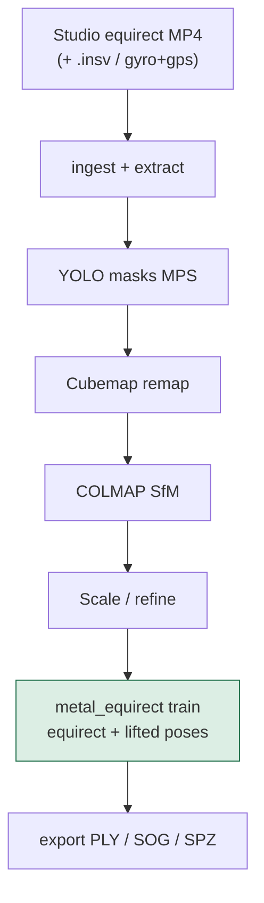

# Metal splat workflow

End-to-end guide for InstaSplat’s **metal_equirect** pipeline on Apple Silicon:
from Studio equirect video → COLMAP → native 360 Gaussian training → export.

This is the **only** training path. There is no Brush/OpenSplat backend.

---

## 1. What “metal splat” means here

| Term | Meaning |
|------|---------|
| **Equirect frames** | Full 360×180 panoramas (`01_frames/equirect/`) |
| **Cubemap SfM** | COLMAP runs on perspective faces for reliable Mac reconstruction |
| **Pose lift** | `{stem}_front` COLMAP poses → one pose per panorama for training |
| **metal_equirect** | PyTorch MPS trainer with 3DGUT-style Unscented Transform projection |
| **Exports** | `scene.ply` (+ sog/spz via splat-transform) |



Deep trainer internals: [METAL_EQUIRECT_TRAINER.md](METAL_EQUIRECT_TRAINER.md).  
Long / 8K tiling: [MAC_LONG_360.md](MAC_LONG_360.md).

---

## 2. Install (once)

### Recommended (one script)

```bash
git clone https://github.com/Browens5/InstaSplat.git
cd InstaSplat
./scripts/setup_macos.sh          # brew + npm + .venv + pip -e '.[gui,dev]'
source .venv/bin/activate
instasplat doctor                 # mac_long_360 should be yes
```

Options:

| Env | Effect |
|-----|--------|
| `WITH_GUI=0` | Skip PySide6 (`pip install -e '.[dev]'` only) |
| `SKIP_BREW=1` | Do not run Homebrew |
| `SKIP_PIP=1` | Do not create venv / pip install |

### Equivalent manual steps

```bash
brew install ffmpeg exiftool colmap git
npm i -g @playcanvas/splat-transform
python3 -m venv .venv && source .venv/bin/activate
pip install -e ".[gui,dev]"
instasplat setup --verify         # check tools + Python side
instasplat doctor
```

### Quick checks

```bash
instasplat setup                  # can install missing brew/npm tools
instasplat setup --verify         # check only
instasplat doctor                 # stage readiness table + MPS report
```

**Apple Silicon:** if `doctor` shows PyTorch without MPS, install the official
MPS wheel from [pytorch.org](https://pytorch.org), then re-run `doctor`.

---

## 3. Capture checklist

1. Record with an Insta360 (walk slowly; good overlap; fewer crowds).
2. In **Insta360 Studio**, export **equirectangular** MP4 (not a flat reframe).
3. Keep the sibling `.insv` next to the MP4 (gyro/GPS), **or** add `gyro.csv` / `gps.csv`.

MediaSDK does **not** run on macOS — Studio stitch is the supported local path.
See [CAPTURE_GUIDELINES.md](CAPTURE_GUIDELINES.md).

---

## 4. Choose a run mode

| Mode | When | Command |
|------|------|---------|
| **Tiled (recommended)** | Long walks, 8K, multi-minute clips | `instasplat mac-360 -i …` |
| **Single** | Short clips / experiments | `instasplat run -i …` (no `--large-8k`) |
| **GUI** | Same pipelines, visual controls | `instasplat gui` |

Tiled mode splits time into overlapping chunks, trains each with metal_equirect
(serialized on MPS), then GPS/gyro-aligns and merges.

---

## 5. Stage-by-stage process

### A. Tiled long-360 (default product path)

```bash
instasplat mac-360 -i ./capture_equirect.mp4 -o ./runs -n walk_360
```

| Order | Stage | What happens | Key outputs |
|------:|-------|--------------|-------------|
| 1 | `ingest` | Copy/link video; pull gyro/GPS | `00_ingest/equirect.mp4`, `gyro.csv`, `gps.csv` |
| 2 | `plan_chunks` | Overlapping time windows; denser fps on turns | `10_chunks/manifest.json` |
| 3 | `preflight` | ffmpeg/colmap/torch/disk/stitch guards | `preflight.json` |
| 4 | `process_chunks` | Per tile: mask → cubemap → COLMAP → scale → refine → **train** → export | `10_chunks/chunk_*/…` |
| 5 | `align_chunks` | Sim3 align with GPS/gyro | alignment reports |
| 6 | `merge_chunks` | splat-transform merge + prune | `11_merged/scene_merged.ply` |
| 7 | `package` | quality + LOD + cloud handoff | `quality.json`, `cloud_job.json`, `06_export/` |

Inside each tile’s **train** step (metal_equirect):

1. Load equirect frames + masks for that chunk  
2. Lift COLMAP cubemap poses (`*_front` → panorama)  
3. Init Gaussians from sparse points  
4. Optimize with UT equirect rasterizer (MPS)  
5. Densify / prune; write previews + PLY  

```text
10_chunks/chunk_000/
  01_frames/equirect/     ← panoramas for this tile
  02_masks/equirect/
  03_sfm/images/          ← cubemap faces for COLMAP
  03_sfm/sparse/0/        ← cameras / points
  05_train/exports/
    scene.ply
    equirect_*.ply
    previews/step_*.jpg
    train_heartbeat.json
```

### B. Single-job (short capture)

```bash
instasplat run -i ./short_equirect.mp4 -o ./runs -n short \
  --stages ingest,extract,mask,sfm,scale,refine,train,export,package
```

Same train logic; no chunk plan/merge.

### C. Resume / train only

```bash
# Continue a job (skips finished tiles when skip_existing=true)
instasplat run --job ./runs/walk_360 --only process_chunks

# Re-train after SfM already exists
instasplat train-equirect -j ./runs/walk_360 --steps 8000
# or
instasplat run --job ./runs/walk_360 --only train
```

GUI: **Open previous run…** → check stages → **Continue run**.

---

## 6. Watching progress

| Signal | Where |
|--------|--------|
| CLI / GUI log | Stage messages + loss / Gaussian count |
| Live 3D viewer | Sparse COLMAP cloud during SfM; splat centers when PLYs appear |
| Artifacts tab | Frames, masks, models, PLYs, **preview** JPEGs |
| Heartbeat | `05_train/exports/train_heartbeat.json` (step, loss, n_gaussians) |
| Previews | `05_train/exports/previews/step_XXXXXX.jpg` (equirect renders) |

Pause in the GUI freezes the pipeline at stage checkpoints.

---

## 7. Outputs to open / share

```text
runs/walk_360/
  06_export/scene.ply      ← primary splat
  06_export/scene.sog
  06_export/scene.spz
  11_merged/…              ← tiled merge products
  quality.json
  cloud_job.json           ← optional CUDA 3DGUT handoff
```

Viewers: PlayCanvas SuperSplat, MetalSplatter, and other Gaussian viewers that
read PLY/SOG/SPZ.

---

## 8. Config knobs (train)

```yaml
train:
  backend: metal_equirect   # sole backend
  total_steps: 15000
  max_resolution: 1024      # equirect width (height = width/2)
  export_every: 2000
  sh_degree: 1
  lr: 0.01
  with_eval3d: true         # 3DGUT-style 3D response
  composite: tile           # tile (quality) | oit (faster)
  sh_warmup_steps: 500
  densify_every: 200

metal:
  prefer_metal: true
  serialize_train: true     # one tile train at a time (MPS memory)
```

| Goal | Suggestion |
|------|------------|
| Faster laptop iterate | `total_steps: 8000`, `max_resolution: 768`, `composite: oit` |
| Higher quality | `total_steps: 20000`, `max_resolution: 1280`, `sfm.face_resolution: 1280` |
| Less VRAM pressure | keep `serialize_train: true`, lower `max_resolution` |

Starter YAML: `examples/large8k.example.yaml`, `instasplat init-config --large-8k`.

---

## 9. Troubleshooting

| Symptom | Fix |
|---------|-----|
| `doctor` train = no | `pip install -e .` / ensure torch imports; MPS wheel on Apple Silicon |
| Preflight: no trainer | Same as above (PyTorch required) |
| Empty COLMAP / SfM fail | Use `perspective_cubemap`; for tiled jobs run `process_chunks`, not top-level `sfm` |
| Train: no equirect views | Ensure `01_frames/equirect` exists and COLMAP images are `{stem}_front.jpg` or native names |
| MPS OOM mid-train | Lower `train.max_resolution` / `total_steps`; keep `serialize_train: true` |
| YOLO MPS crash | Pipeline auto-falls back to CPU for masks |
| Merge blocked | Fix failed tiles or pass `--allow-partial-merge` |

---

## 10. Command cheat sheet

```bash
# Install
./scripts/setup_macos.sh && source .venv/bin/activate

# Health
instasplat setup
instasplat doctor

# Full tiled metal splat
instasplat mac-360 -i ./capture_equirect.mp4 -o ./runs -n walk

# GUI
instasplat gui

# Sections
instasplat stages --mode tiled
instasplat run --job ./runs/walk --only train
instasplat train-equirect -j ./runs/walk --steps 8000

# Validate packaging
instasplat validate --job ./runs/walk
```

---

## See also

- [SETUP_MACOS.md](SETUP_MACOS.md) — install details  
- [MAC_LONG_360.md](MAC_LONG_360.md) — tiled defaults & safety rails  
- [METAL_EQUIRECT_TRAINER.md](METAL_EQUIRECT_TRAINER.md) — rasterizer / UT architecture  
- [LARGE_8K.md](LARGE_8K.md) — chunk tuning  
- [CLOUD.md](CLOUD.md) — optional CUDA 3DGUT scale path  
